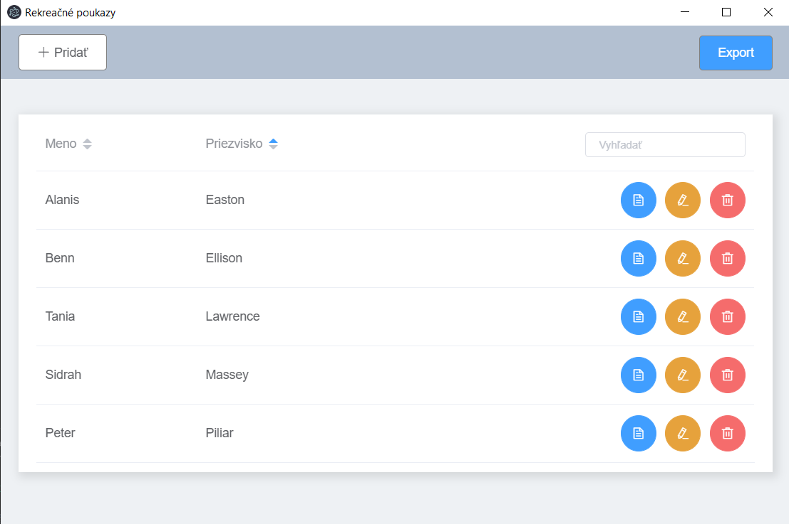
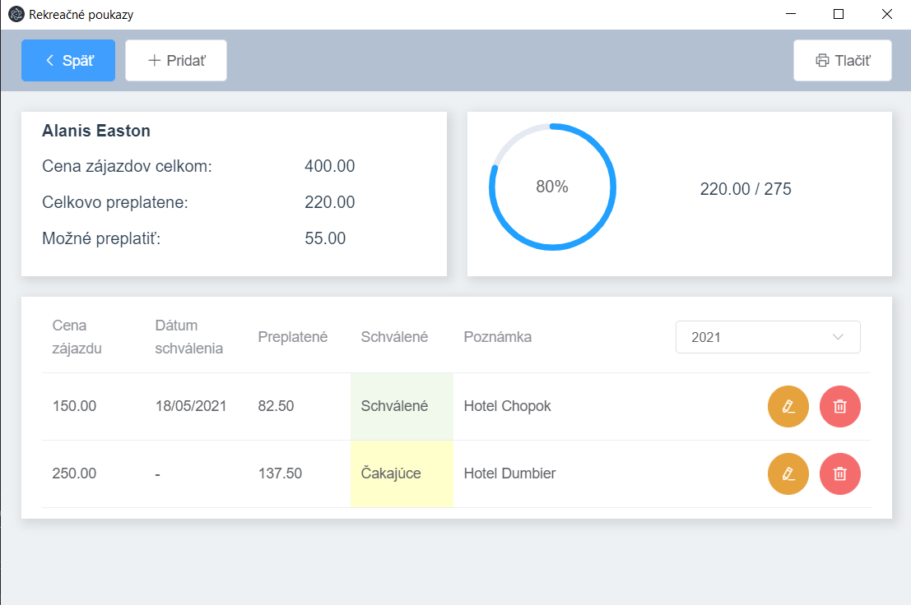

[](https://ci.appveyor.com/project/ppiliar/rekreacne-poukazy)
[](https://sonarcloud.io/dashboard?id=ppiliar_rekreacne-poukazy)

# Rekreačné-poukazy

Electron aplikácia na evidenciu preplatených rekreačných poukazov 

## Screenshots



## Project setup
```
npm install
```

### Compiles and hot-reloads for development
```
npm run electron:serve
```

### Compiles and minifies for production
```
npm run electron:build
```

## Pre-built binary for windows
You can download pre-build binary [here](https://github.com/ppiliar/rekreacne-poukazy/releases/tag/v0.1.2)

### Customize configuration
See [Configuration Reference](https://cli.vuejs.org/config/).
